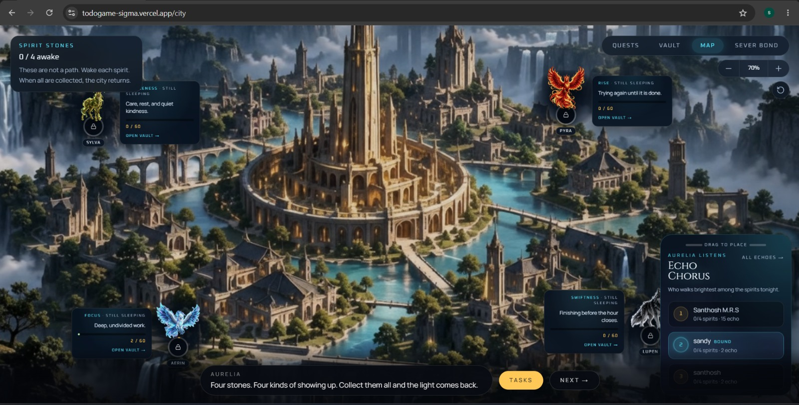

# EchoBound



**Real work restores a fallen city.** EchoBound is a Life RPG. A traveler writes the tasks of their own day. Finishing them earns XP, shards, and spirit echoes — and Aurelia slowly wakes.

A traveler does not choose a class, a difficulty, or a companion. The city watches how they live — and answers.

## The journey

1. **Dawn.** The game opens on a cliff above Aurelia. The traveler begins the journey.
2. **The telling.** First-time visitors hear how the city fell. Returning visitors are taken straight home.
3. **The bond.** They sign in and become a named traveler of Aurelia.
4. **The city.** Four spirit stones stand across the map. The traveler can wander — pan, zoom, and read each stone. Each spirit wakes at 60 echo. When all four are awake, the city brightens.
5. **The board.** Work is kept as lists, groups, and tasks — ordinary life, written in their own words. The game reads the work; the traveler only names it.
6. **A finished task.** Completing something real earns XP, shards, and a streak. One spirit notices them, awards a small honest echo (1–4), and leaves a short notice of what it saw.
7. **The vault.** Four companion cards hold those notices. Opening a card shows what that spirit has remembered.
8. **The chorus.** Travelers are ranked by how many spirits they have woken, then by total echo. The same chorus runs quietly on the city map.

Closing the tab does not erase the city. The traveler’s progress waits for them.

## Four spirits

| Spirit | Trait | Wakes when the traveler… |
| --- | --- | --- |
| **Aerin** (eagle) | Focus | Stay with one deep piece of work |
| **Lupen** (wolf) | Swiftness | Finish *before* a real due time |
| **Sylva** (deer) | Gentleness | Rest, care, patience, kindness |
| **Pyra** (phoenix) | Rise | Come back after a miss, or finish late anyway |

A card **awakens at 60**. Rank is **cards first**, then echo score.

## Fair play

Progress is saved to the traveler’s account, not the browser. They cannot pick which spirit answers or how much echo a task is worth. One finished task wakes one spirit, in a small score. Empty titles do not impress the city. The map, the vault, and the chorus all read the same record.

## What the traveler uses

**City.** A wide painted map they can pan and zoom. Four spirit stones sit on the water-city; each opens a small card (asleep or awake, echo toward 60). A story line at the bottom coaches the next kind of effort. A live chorus rises in the corner. The HUD stays light — Quests, Vault, Map, and leave — so the city is the screen, not a menu.

**Board.** A dusk sanctum over the cliff art: gold XP bar, level, and name at the top. Work is Lists, Groups, and Tasks — with due times and priority when they want them. A first-visit guide walks the board. Beside the list, the leading companion watches and fills. Checking a task off is one tap.

**After a finish.** A spirit whisper appears at once. XP on the bar moves. Echo ticks on a card. The same finish can lift their line on the chorus.

**Vault.** Four portrait cards. Sleeping art until 60; then the companion is awake. Opening a card shows the notices — not a spreadsheet of chores.

**Chorus.** A full rank list of travelers, same rules as the map overlay: woken spirits first, then echo.

**Feel.** Soft glass panels, gold and cyan light, motion that settles quickly. Loading screens keep the same world so a wait still looks like Aurelia.

## Why it works as a to-do

A plain list only empties. EchoBound still empties the list — then pays the traveler *now*.

Finish something and the world answers in seconds: a whisper, a pulse on the XP bar, a sliver of echo on a stone. That is the instant hit. Keep finishing and the hit compounds — a card wakes, the city brightens, a name climbs the chorus. The task was real life; the reward is visible, small, and immediate, so opening the app tomorrow still feels worth it.

## Stack

Next.js 16 · React 19 · Tailwind 4 · Clerk · Supabase (`rpg_*`) · Mistral (quest shape + spirit judge)

```bash
npm install
# fill .env.local: Clerk, Supabase, SITE_URL, RPG_SERVER_SECRET, MISTRAL_API_KEY
npm run dev
```

Open [http://localhost:3000](http://localhost:3000). After sign-in: **City → Quests → Vault → Chorus**.